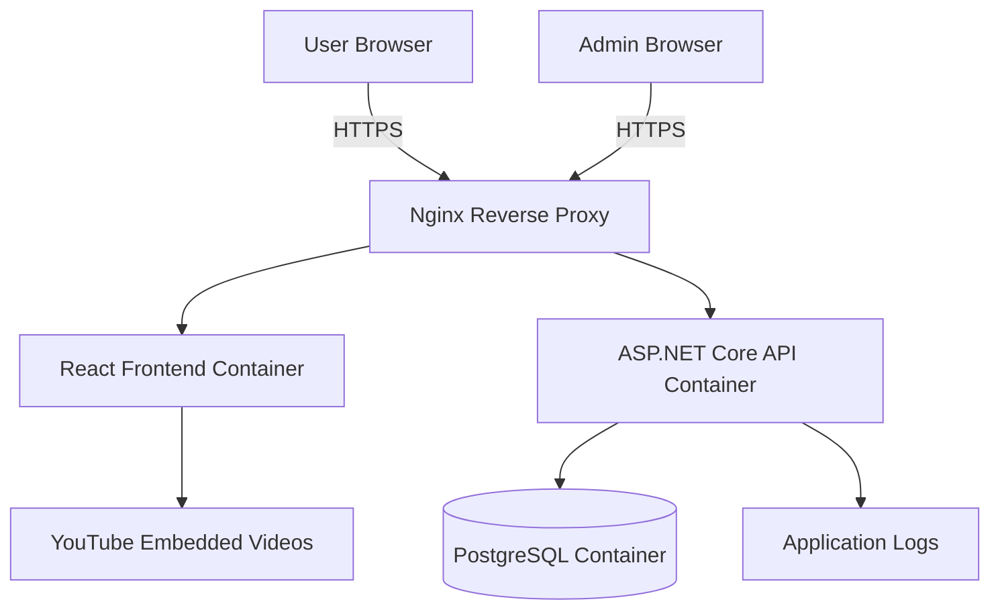
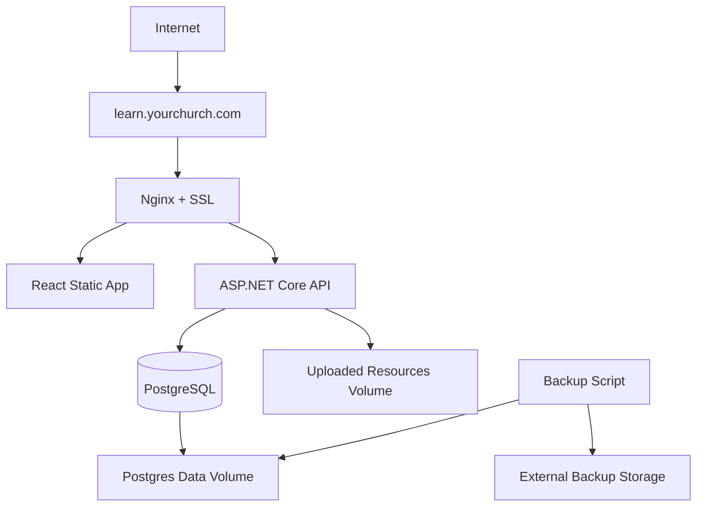
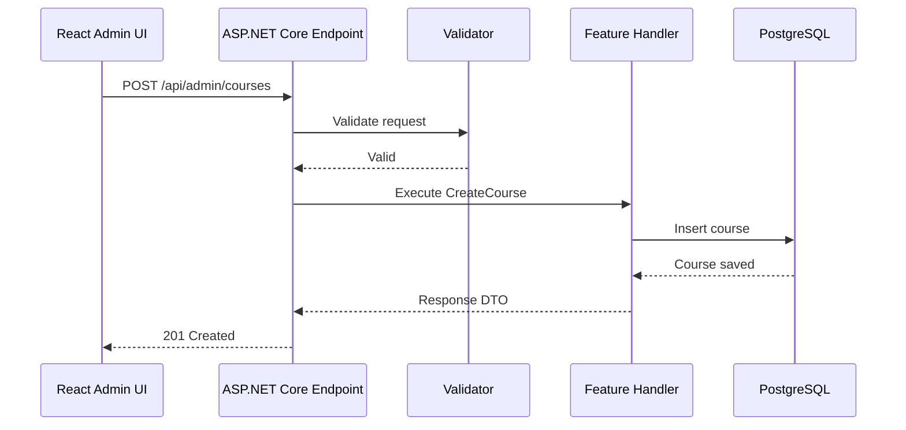
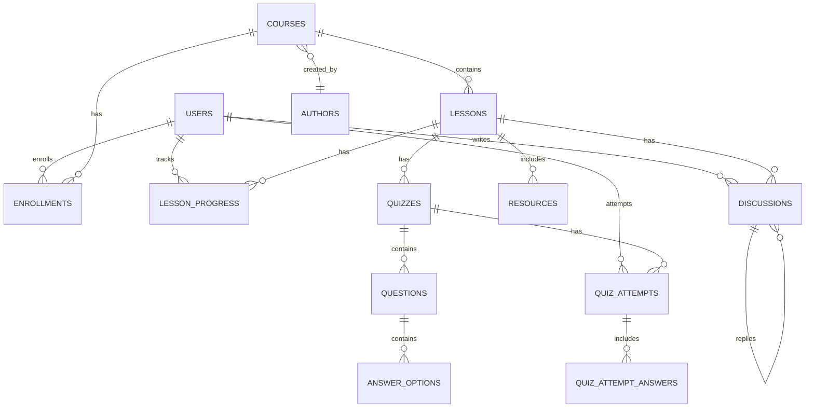
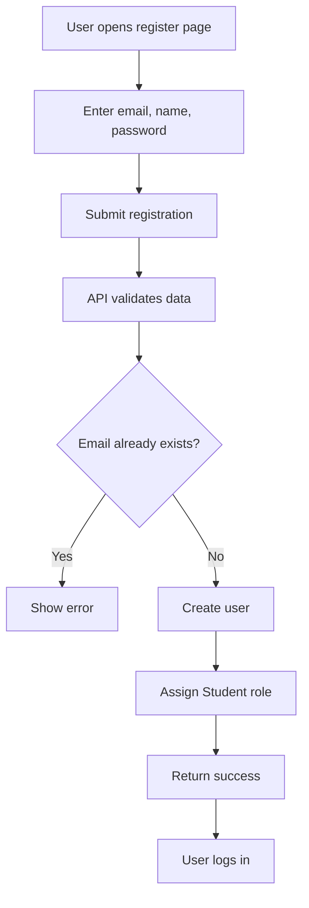
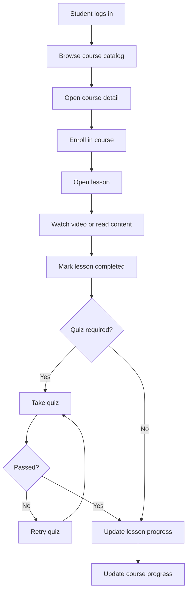
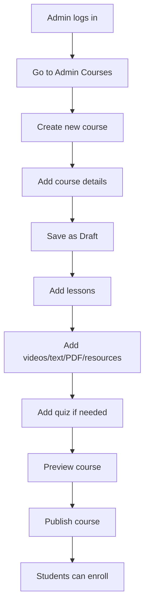
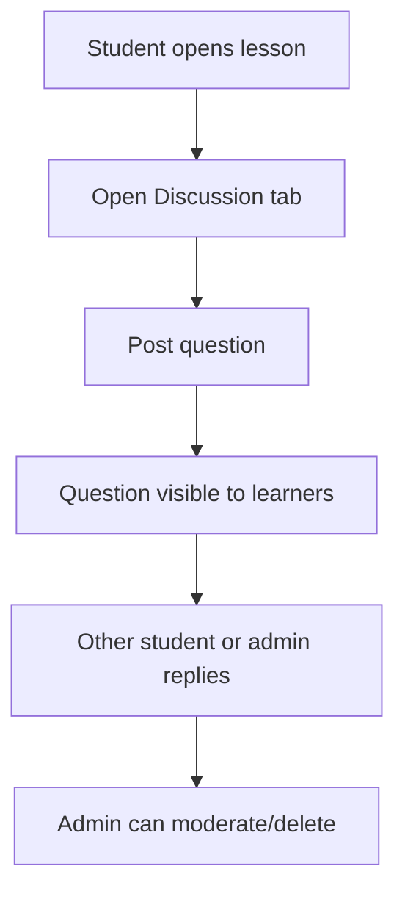
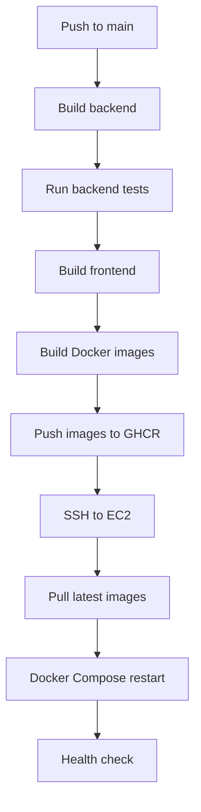

# Church E-learning Platform — Execution Plan and Task Breakdown

**Project:** Church E-learning Website  
**Target users:** ~1,000 church members  
**Developer capacity:** 1 developer using GitHub Copilot Pro  
**Backend:** ASP.NET Core Web API  
**Frontend:** React + TypeScript  
**Architecture style:** Vertical Slice Architecture / Modular Monolith  
**Database:** PostgreSQL  
**Deployment:** Docker containers on existing EC2 server  
**CI/CD:** GitHub Actions  
**Video strategy:** YouTube embedded links  
**Estimated timeline:** 12–16 weeks for recommended MVP  

---

## 1. Project Goal

Build a church E-learning platform similar to a simple Udemy-style system where church members can self-register, log in, enroll in courses, watch video lessons, read text/PDF lessons, complete quizzes, join lesson discussions, and track progress.

Admins can manage courses, lessons, quizzes, authors, users, roles, discussions, and progress reports.

---

## 2. Confirmed MVP Scope

### 2.1 Student Portal

The Student Portal should support:

- Self-registration by email
- Login and logout
- View published course catalog
- View course detail
- Enroll in course
- Watch YouTube embedded video lessons
- Read text lessons
- Open/read PDF lessons
- View/download learning resources
- Mark lessons as completed
- Take quizzes
- See quiz pass/fail result
- Retry quizzes without limit
- Ask questions in lesson discussion tab
- Reply in discussions
- View personal course progress
- Continue learning from last lesson
- Request password reset by email
- Reset password using email link

### 2.2 Admin Portal

The Admin Portal should support:

- Manage users
- Manage roles
- Manage authors
- Manage courses
- Manage lessons
- Manage YouTube video links
- Manage text/PDF lesson content
- Manage resources
- Manage quizzes
- Manage quiz questions and answers
- Moderate lesson discussions
- View learner progress
- View course progress reports

### 2.3 Roles

Recommended MVP roles:

| Role | Description |
|---|---|
| Student | Default role after registration. Can learn courses, take quizzes, and join discussions. |
| Admin | Can manage courses, lessons, quizzes, users, and reports. |
| SuperAdmin | Can manage admins, global settings, and high-level system configuration. |
| Teacher / Author | Optional for MVP. Can be added later if course creators need their own portal. |

---

## 3. Out of Scope for MVP

Do not build these in the first release:

- Payment
- Certificates
- Mobile app
- Real-time chat
- Live streaming
- Private video hosting
- File upload hosting (PDFs must be externally hosted links — Google Drive, OneDrive, or any public URL)
- Group management
- Advanced analytics
- AI assistant
- Complex notification system
- Multi-tenant support


---

## 4. Additional Non-Functional Requirements

These requirements should be treated as part of the MVP quality baseline, not optional polish.

### 4.1 Web Responsive UI Requirements

The website must work well on common devices used by church members:

- Desktop and laptop browsers
- Tablets
- Mobile phones

Responsive design goals:

```text
Mobile first where practical
Clean layout on desktop
Readable typography
Easy touch targets
Simple navigation
Fast page loading
Accessible color contrast
```

Minimum supported screen sizes:

| Device Type | Target Width |
|---|---:|
| Mobile | 360px and above |
| Tablet | 768px and above |
| Desktop | 1024px and above |
| Large desktop | 1280px and above |

Key responsive UI rules:

- Course catalog must display as one column on mobile, two columns on tablet, and three or more columns on desktop.
- Learning page should adapt from two-column layout on desktop to single-column layout on mobile.
- Lesson sidebar should collapse into a drawer, accordion, or top selector on mobile.
- Admin tables should support horizontal scrolling or responsive card layout on small screens.
- Forms should be usable on mobile without zooming.
- Buttons and links should be easy to tap on touch devices.
- YouTube embedded videos should maintain proper aspect ratio on all screens.
- Text/PDF lesson content should be readable on mobile.

Recommended frontend approach:

```text
Use Tailwind CSS responsive utilities
Use reusable layout components
Design mobile layout early
Test each page in browser dev tools
Avoid fixed pixel widths unless necessary
```

Responsive acceptance criteria:

- User can register and login on mobile.
- Student can browse courses on mobile.
- Student can watch a YouTube lesson on mobile.
- Student can read text/PDF lesson content on mobile.
- Student can complete quiz on mobile.
- Student can post discussion question on mobile.
- Admin portal is usable on tablet/desktop; basic admin tasks should still be possible on mobile.

### 4.2 UI/UX Quality Requirements

The UI should feel simple, warm, and clear for church members, including non-technical users.

General UI principles:

- Keep pages simple and focused.
- Avoid too many actions on one screen.
- Use clear labels instead of technical words.
- Show helpful empty states.
- Show loading states when data is being fetched.
- Show friendly error messages.
- Make the primary action obvious.
- Keep colors and spacing consistent.
- Avoid clutter in the learning page.

Required UI states for key pages:

```text
Loading state
Error state
Empty state
Success state
Permission denied state
```

Examples:

```text
No courses yet -> "No courses are available right now. Please check again later."
No enrolled courses -> "You have not enrolled in any course yet. Start learning today."
Quiz failed -> "You did not pass this time. You can review the lesson and try again."
```

### 4.3 Coding Convention Requirements

The codebase should follow consistent coding conventions so that the project remains maintainable as it grows.

Backend coding conventions:

- Use clear C# naming conventions.
- Use PascalCase for public classes, methods, properties, and records.
- Use camelCase for local variables and parameters.
- Keep methods short and focused.
- Prefer explicit names over abbreviations.
- Use async/await for I/O operations.
- Include CancellationToken in API handlers where practical.
- Do not return EF Core entities directly from API endpoints.
- Use DTOs for request and response contracts.
- Keep validation close to the feature.
- Keep authorization rules explicit.
- Add database indexes for common lookup fields.

Minimum required indexes:

```text
Enrollments: unique index on (UserId, CourseId)
LessonProgress: unique index on (UserId, LessonId)
Courses: unique index on (Slug)
QuizAttempts: index on (UserId, QuizId)
Discussions: index on (LessonId)
Lessons: index on (CourseId, OrderIndex)
```

Frontend coding conventions:

- Use TypeScript strictly.
- Use PascalCase for React components.
- Use camelCase for variables, functions, hooks, and props.
- Prefix custom hooks with `use`.
- Keep components small and focused.
- Separate page components, feature components, API functions, and types.
- Avoid hardcoded API URLs.
- Use environment variables for configuration.
- Use shared UI components for common patterns.
- Prefer meaningful names over short names.

Git conventions:

```text
feat(auth): add email registration
feat(courses): add course catalog page
fix(quiz): correct pass/fail calculation
chore(ci): add backend build workflow
docs(plan): update responsive UI requirements
```

Branch naming:

```text
feature/auth-registration
feature/course-catalog
feature/responsive-learning-page
fix/quiz-score-calculation
chore/github-actions-ci
```

### 4.4 Clean Code Requirements

Clean Code is required for long-term maintainability.

Rules:

- Code should be easy to read before it is clever.
- One function should do one clear thing.
- Avoid deeply nested logic.
- Avoid duplicate logic.
- Prefer small, meaningful methods.
- Keep business rules visible and testable.
- Avoid magic strings and magic numbers.
- Use constants or enums for repeated values.
- Remove unused code.
- Keep comments for explaining why, not obvious what.
- Prefer readable code over excessive comments.

Examples of good naming:

```text
CalculateCourseProgress
MarkLessonAsCompleted
SubmitQuizAttempt
CanAccessAdminPortal
GetPublishedCourses
```

Examples to avoid:

```text
DoStuff
HandleData
Process
Temp
ManagerHelper
```

### 4.5 SOLID Principles Requirements

The project should follow SOLID principles pragmatically. Do not over-engineer, but use these principles to avoid messy code.

#### Single Responsibility Principle

Each class, component, handler, or function should have one main responsibility.

Good:

```text
CreateCourseHandler creates a course.
SubmitQuizHandler submits and scores a quiz attempt.
CourseCard displays one course card.
```

Avoid:

```text
One giant CourseService that handles courses, lessons, quizzes, progress, and reports.
```

#### Open/Closed Principle

Code should be easy to extend without rewriting large parts.

Example:

```text
Add a new lesson content type without rewriting the whole lesson page.
```

#### Liskov Substitution Principle

Use inheritance carefully. Prefer composition for most application logic.

Recommendation:

```text
Avoid deep inheritance trees.
Use interfaces only when they add real value.
```

#### Interface Segregation Principle

Do not create huge interfaces.

Good:

```text
ICurrentUser
IEmailSender
IStorageService
```

Avoid:

```text
IApplicationService with many unrelated methods.
```

#### Dependency Inversion Principle

High-level business logic should not depend directly on infrastructure details.

Example:

```text
Feature handler depends on ICurrentUser instead of directly reading HttpContext everywhere.
Feature handler depends on IEmailSender instead of directly using SMTP code.
```

### 4.6 KISS Principle Requirements

KISS means **Keep It Simple, Stupid**. For this project, simplicity is very important because there is only one developer.

Rules:

- Prefer simple solutions over complex architecture.
- Do not add microservices.
- Do not add Kubernetes.
- Do not add event sourcing.
- Do not add complex CQRS infrastructure unless needed.
- Do not build advanced analytics before the core learning flow works.
- Do not build private video hosting in MVP.
- Do not add new libraries unless they solve a real problem.

Preferred MVP approach:

```text
Modular monolith
Vertical slices
PostgreSQL
Docker Compose
YouTube embedded videos
Simple admin portal
Simple reports
Simple monitoring
```

### 4.7 DRY and YAGNI Guidelines

Use DRY carefully:

- Avoid obvious duplication.
- But do not create abstractions too early.
- Two similar pieces of code are not always a problem.
- Three or more repeated patterns may be a good time to extract shared code.

Use YAGNI:

```text
You Aren't Gonna Need It
```

Do not build features before they are truly needed.

Examples to postpone:

```text
Certificates
Payments
Mobile app
Real-time chat
Advanced video analytics
Multi-tenant support
```

### 4.8 Code Review Checklist for Quality Principles

Before merging any feature, check:

```text
[ ] Code is readable and easy to understand
[ ] Methods/components are not too large
[ ] No unnecessary abstraction
[ ] No duplicated business logic
[ ] DTOs are used for API contracts
[ ] Authorization is checked server-side
[ ] Validation is implemented
[ ] UI has loading/error/empty states
[ ] Mobile/responsive layout is acceptable
[ ] No hardcoded secrets
[ ] No unrelated code changes
[ ] Tests or manual test checklist are completed
```

---

## 5. Recommended Architecture

Use a **modular monolith with vertical slice architecture**.

This is better than microservices because:

- One developer can maintain it more easily
- Deployment is simpler
- Debugging is easier
- Cost is lower
- It is enough for ~1,000 users
- Features are organized by business capability instead of technical layer only

---

## 6. High-Level System Architecture



---

## 7. Deployment Architecture on EC2



Recommended domain routing:

```text
learn.yourchurch.com        -> React frontend
learn.yourchurch.com/api    -> ASP.NET Core API
```

---

## 8. Vertical Slice Architecture Design

### 8.1 Why Vertical Slice Architecture

Traditional layered architecture often groups code like this:

```text
Controllers
Services
Repositories
DTOs
Validators
```

Vertical slice architecture groups code by feature:

```text
Features/Auth
Features/Courses
Features/Lessons
Features/Quizzes
Features/Discussions
Features/Progress
```

Each feature owns its request, handler, validation, DTO, and endpoint logic.

Benefits:

- Easier to find feature code
- Less unnecessary abstraction
- Easier to change one feature without affecting others
- Works well with CQRS-style commands and queries
- Good for solo developer productivity

---

## 9. Backend Project Structure

Recommended ASP.NET Core solution structure:

```text
backend/
  ChurchLearn.sln
  src/
    ChurchLearn.Api/
      Program.cs
      appsettings.json
      appsettings.Production.json
      Dockerfile
      Common/
      Middleware/
      Extensions/
      Features/
        Auth/
        Users/
        Courses/
        Lessons/
        Enrollments/
        Progress/
        Quizzes/
        Discussions/
        Reports/
        Resources/
      Infrastructure/
        Persistence/
        Identity/
        Storage/
        Email/
        Logging/
      Domain/
        Entities/
        Enums/
        Common/
  tests/
    ChurchLearn.Api.Tests/
    ChurchLearn.IntegrationTests/
```

For a solo developer, you can keep everything inside `ChurchLearn.Api` at first, while still organizing by feature. Later, you can extract Application/Domain/Infrastructure projects if needed.

---

## 10. Example Feature Folder Structure

Example for Courses:

```text
Features/
  Courses/
    CreateCourse/
      CreateCourseRequest.cs
      CreateCourseResponse.cs
      CreateCourseValidator.cs
      CreateCourseEndpoint.cs
      CreateCourseHandler.cs
    UpdateCourse/
      UpdateCourseRequest.cs
      UpdateCourseValidator.cs
      UpdateCourseEndpoint.cs
      UpdateCourseHandler.cs
    GetCourseBySlug/
      GetCourseBySlugEndpoint.cs
      GetCourseBySlugQuery.cs
      GetCourseBySlugHandler.cs
    GetCourses/
      GetCoursesEndpoint.cs
      GetCoursesQuery.cs
      GetCoursesHandler.cs
    PublishCourse/
      PublishCourseEndpoint.cs
      PublishCourseHandler.cs
```

Example command flow:



---

## 11. Frontend Project Structure

Recommended React structure:

```text
frontend/
  Dockerfile
  nginx.conf
  package.json
  vite.config.ts
  src/
    app/
      App.tsx
      router.tsx
      providers.tsx
    assets/
    components/
      ui/
      layout/
      forms/
    features/
      auth/
      courses/
      lessons/
      learning/
      quizzes/
      discussions/
      admin/
      reports/
    hooks/
    lib/
      api-client.ts
      auth.ts
      constants.ts
    pages/
      public/
      student/
      admin/
    styles/
```

Recommended frontend libraries:

- React
- TypeScript
- Vite
- React Router
- TanStack Query
- React Hook Form
- Zod
- Tailwind CSS
- shadcn/ui
- Axios or Fetch wrapper

---

## 12. Database Design Overview



---

## 13. Core Database Tables

### 13.1 Identity Tables

Use ASP.NET Core Identity:

```text
AspNetUsers
AspNetRoles
AspNetUserRoles
AspNetUserClaims
AspNetRoleClaims
AspNetUserTokens
```

Default registered user role:

```text
Student
```

### 13.2 Courses

```text
Courses
- Id
- Title
- Slug
- ShortDescription
- Description
- ThumbnailUrl
- Category
- Level
- Language
- AuthorId
- Status
- CreatedAt
- UpdatedAt
```

### 13.2a Authors

```text
Authors
- Id
- UserId (optional link to AspNetUsers)
- Name
- Bio
- AvatarUrl
- CreatedAt
- UpdatedAt
```

### 13.3 Lessons

```text
Lessons
- Id
- CourseId
- Title
- Description
- ContentType
- YouTubeUrl
- TextContent
- PdfUrl (external URL only — Google Drive, OneDrive, or any public link; file upload is out of scope for MVP)
- DurationSeconds
- OrderIndex
- IsPreview
- CreatedAt
- UpdatedAt
```

### 13.4 Enrollments

```text
Enrollments
- Id
- UserId
- CourseId
- EnrolledAt
- ProgressPercent
- CompletedLessonsCount
- TotalLessonsCount
- CompletedAt
```

### 13.5 LessonProgress

```text
LessonProgress
- Id
- UserId
- CourseId
- LessonId
- IsCompleted
- CompletedAt
- ManualCompletedAt
- VideoProgressPercent
- VideoWatchedSeconds
- QuizPassed
- LastWatchedAt
```

### 13.6 Quizzes

```text
Quizzes
- Id
- LessonId
- Title
- Description
- PassingScore
- IsRequired
- CreatedAt
- UpdatedAt
```

### 13.7 Questions

```text
Questions
- Id
- QuizId
- Text
- Type
- OrderIndex
```

Question types:

```text
SingleChoice
MultipleChoice
TrueFalse
```

### 13.8 AnswerOptions

```text
AnswerOptions
- Id
- QuestionId
- Text
- IsCorrect
- OrderIndex
```

### 13.9 QuizAttempts

```text
QuizAttempts
- Id
- QuizId
- UserId
- Score
- Passed
- StartedAt
- SubmittedAt
```

### 13.10 QuizAttemptAnswers

```text
QuizAttemptAnswers
- Id
- QuizAttemptId
- QuestionId
- SelectedAnswerOptionId
- IsCorrect
```

### 13.11 Discussions

```text
Discussions
- Id
- LessonId
- UserId
- ParentDiscussionId
- Content
- CreatedAt
- UpdatedAt
- IsDeleted
- DeletedBy
- DeletedAt
```

---

## 14. Business Flows

### 14.1 User Registration Flow



### 14.2 Learning Flow



### 14.3 Admin Course Creation Flow



### 14.4 Discussion Flow



---

## 15. API Groups

### 15.1 Auth APIs

```http
POST /api/auth/register
POST /api/auth/login
POST /api/auth/logout
GET  /api/auth/me
```

### 15.2 Admin User APIs

```http
GET /api/admin/users
GET /api/admin/users/{id}
PUT /api/admin/users/{id}/roles
POST /api/admin/users/{id}/activate
POST /api/admin/users/{id}/deactivate
```

### 15.3 Course APIs

```http
GET    /api/courses
GET    /api/courses/{slug}
POST   /api/admin/courses
PUT    /api/admin/courses/{id}
DELETE /api/admin/courses/{id}
POST   /api/admin/courses/{id}/publish
POST   /api/admin/courses/{id}/unpublish
```

### 15.4 Lesson APIs

```http
GET    /api/courses/{courseId}/lessons
GET    /api/lessons/{id}
POST   /api/admin/courses/{courseId}/lessons
PUT    /api/admin/lessons/{id}
DELETE /api/admin/lessons/{id}
```

### 15.5 Enrollment and Progress APIs

```http
POST /api/courses/{courseId}/enroll
GET  /api/me/courses
GET  /api/me/courses/{courseId}/progress
POST /api/lessons/{lessonId}/complete
POST /api/lessons/{lessonId}/video-progress
```

### 15.6 Quiz APIs

```http
GET  /api/lessons/{lessonId}/quiz
POST /api/admin/lessons/{lessonId}/quiz
PUT  /api/admin/quizzes/{quizId}
POST /api/quizzes/{quizId}/submit
GET  /api/quizzes/{quizId}/attempts/me
```

### 15.7 Discussion APIs

```http
GET    /api/lessons/{lessonId}/discussions
POST   /api/lessons/{lessonId}/discussions
POST   /api/discussions/{discussionId}/reply
PUT    /api/discussions/{discussionId}
DELETE /api/admin/discussions/{discussionId}
```

### 15.8 Report APIs

```http
GET /api/admin/reports/overview
GET /api/admin/reports/courses/{courseId}/learners
GET /api/admin/reports/users/{userId}/progress
```

---

## Execution Timeline Overview

Recommended plan:

```text
Total duration: 16 weeks
Sprint length: 1 week
Developer: 1 person
Release strategy: Vertical slices, one working feature at a time
```

---

# 16. Detailed Sprint Plan

## Sprint 0 — Project Preparation

**Duration:** 2–3 days  
**Goal:** Prepare project foundation and confirm execution approach.

### Tasks

- Create GitHub repository
- Create project README
- Define MVP scope
- Define initial database model
- Prepare issue labels in GitHub
- Prepare milestone structure
- Decide domain/subdomain name
- Check EC2 resources: CPU, RAM, disk, existing services

### Deliverables

- Repository created
- Initial README created
- MVP scope confirmed
- Technical plan confirmed
- EC2 capacity confirmed: CPU, RAM, disk space documented
- Existing EC2 services and port usage documented

### Acceptance Criteria

- Developer can clone the repo
- Project structure is clear
- MVP backlog is visible in GitHub Issues
- EC2 has confirmed available capacity (minimum 1 GB free RAM)
- Ports 80 and 443 are available on EC2
- No conflicting services identified on EC2

---

## Sprint 1 — Solution Setup and Local Docker Environment

**Duration:** Week 1  
**Goal:** Create runnable backend, frontend, and database locally.

### Backend Tasks

- Create ASP.NET Core Web API project
- Add OpenAPI + Scalar API reference (replaces Swagger UI in .NET 10)
- Add health check endpoint
- Add Serilog logging
- Add PostgreSQL connection
- Add EF Core
- Add initial DbContext
- Add global exception middleware
- Add CORS configuration

### Frontend Tasks

- Create React + TypeScript + Vite app
- Add React Router
- Add TanStack Query
- Add Tailwind CSS
- Add base layout
- Add API client wrapper
- Add environment variable support

### DevOps Tasks

- Create `docker-compose.yml`
- Add PostgreSQL container
- Add API Dockerfile
- Add frontend Dockerfile
- Add `.env.example`
- Set up EC2 production folder and initial Docker Compose on EC2
- Configure GitHub repository secrets (EC2_HOST, EC2_USER, EC2_SSH_KEY, GHCR_USERNAME, GHCR_TOKEN)

### Deliverables

- API runs locally
- Frontend runs locally
- PostgreSQL runs locally
- Docker Compose starts all services
- Scalar API reference is accessible at `/scalar`

### Acceptance Criteria

- `docker compose up` starts database, API, and frontend
- API `/health` returns healthy result
- Frontend can call API health endpoint

---

## Sprint 2 — Authentication and Roles

**Duration:** Week 2  
**Goal:** Users can register, login, and access protected routes.

### Backend Tasks

- Add ASP.NET Core Identity
- Configure Identity with PostgreSQL
- Create roles: Student, Admin, SuperAdmin
- Add user registration endpoint
- Add login endpoint
- Add JWT authentication
- Add current user endpoint
- Assign Student role by default after registration
- Add role-based authorization policies
- Seed initial SuperAdmin account
- Add rate limiting middleware to login and register endpoints (ASP.NET Core built-in RateLimiter)
- Add forgot password endpoint (generate reset token, send reset email)
- Add reset password endpoint (validate token, update password)
- Add basic email sender infrastructure (SMTP or transactional email provider)

### Frontend Tasks

- Create login page
- Create register page
- Create auth store/context
- Store JWT access token in memory (React context/state) — not in localStorage — to prevent XSS token theft
- Use httpOnly cookie for refresh token to enable session persistence across page reloads
- Add protected routes
- Add admin route guard
- Add logout function
- Create forgot password page
- Create reset password page

### CI Tasks

- Add backend build workflow
- Add frontend build workflow
- Run tests/build on pull request
- Add CD deploy workflow: push to main triggers deploy to EC2
- Tag Docker images with git SHA and :latest on every build

### Deliverables

- User can register
- User can login
- Student cannot access admin pages
- Admin/SuperAdmin can access admin pages
- User can reset forgotten password via email

### Acceptance Criteria

- New user receives Student role
- Invalid login shows proper error
- Protected API rejects unauthenticated requests
- Admin route is blocked for Student

---

## Sprint 3 — Course Management Backend

**Duration:** Week 3  
**Goal:** Admin can manage courses through APIs.

### Backend Tasks

- Create Course entity
- Create Author entity
- Create CourseStatus enum
- Add EF Core configuration
- Add migration
- Implement create course vertical slice
- Implement update course vertical slice
- Implement delete/archive course vertical slice
- Implement publish/unpublish course vertical slice
- Implement get published courses endpoint
- Implement get course by slug endpoint
- Add validation for course title, slug, status

### Deliverables

- Course CRUD APIs completed
- Published course APIs completed

### Acceptance Criteria

- Admin can create draft course
- Admin can publish course
- Student/guest can only see published courses
- Slug is unique

---

## Sprint 4 — Course Management Frontend

**Duration:** Week 4  
**Goal:** Admin can manage courses from UI, students can browse courses.

### Frontend Tasks

- Create public course catalog page
- Create course detail page
- Create admin course list page
- Create create course form
- Create edit course form
- Add publish/unpublish actions
- Add course status badges
- Add loading, empty, and error states

### Backend Tasks

- Add pagination for course list
- Add search/filter by title/status
- Add thumbnail URL support

### Deliverables

- Admin course management UI
- Public course browsing UI

### Acceptance Criteria

- Admin can create/edit/publish course from UI
- Student can view published courses
- Draft courses are hidden from students

---

## Sprint 5 — Lesson Management Backend

**Duration:** Week 5  
**Goal:** Admin can create lessons with video, text, PDF, and resources.

### Backend Tasks

- Create Lesson entity
- Create Resource entity
- Create ContentType enum
- Add lesson ordering
- Add YouTubeUrl field
- Add TextContent field
- Add PdfUrl field (external URL only, validate URL format — no file upload)
- Add lesson duration field
- Implement create lesson vertical slice
- Implement update lesson vertical slice
- Implement delete lesson vertical slice
- Implement reorder lessons endpoint
- Implement get course lessons endpoint
- Add validation for YouTube URL and lesson order

### Deliverables

- Lesson CRUD APIs completed
- Resource link support completed

### Acceptance Criteria

- Admin can add lesson to course
- Admin can set video/text/PDF content
- Lessons return in correct order

---

## Sprint 6 — Lesson Management and Learning Page Frontend

**Duration:** Week 6  
**Goal:** Admin can manage lessons and students can view lesson content.

### Admin Frontend Tasks

- Create admin lesson list page
- Create create lesson form
- Create edit lesson form
- Add lesson ordering UI
- Add content type selector
- Add YouTube URL field
- Add text editor field
- Add PDF/resource URL field

### Student Frontend Tasks

- Create learning page layout
- Add lesson sidebar
- Add YouTube embed player
- Add text lesson renderer
- Add PDF open/view link
- Add resources section
- Add next/previous lesson navigation

### Deliverables

- Admin can manage lessons
- Student can open and view lessons

### Acceptance Criteria

- Video lesson displays embedded YouTube player
- Text content displays correctly
- PDF/resource link is accessible
- Lesson sidebar shows all lessons in order

---

## Sprint 7 — Enrollment and My Learning

**Duration:** Week 7  
**Goal:** Students can enroll and continue learning.

### Backend Tasks

- Create Enrollment entity
- Implement enroll course endpoint
- Implement get my courses endpoint
- Implement get enrollment status endpoint
- Prevent duplicate enrollment
- Add access rules for lessons

### Frontend Tasks

- Add enroll button on course detail page
- Create My Learning page
- Add enrolled course cards
- Add continue learning button
- Add enrollment status state

### Deliverables

- Enrollment flow completed
- My Learning page completed

### Acceptance Criteria

- Student can enroll in course
- Student cannot enroll twice
- Enrolled course appears in My Learning
- Continue Learning opens correct course learning page

---

## Sprint 8 — Basic Progress Tracking

**Duration:** Week 8  
**Goal:** Track manual lesson completion and course progress.

### Backend Tasks

- Create LessonProgress entity
- Implement mark lesson completed endpoint
- Implement unmark lesson completed endpoint, optional
- Calculate course progress percentage
- Update enrollment progress
- Store last accessed lesson
- Add get course progress endpoint

### Frontend Tasks

- Add Mark as Completed button
- Add completed indicator in lesson sidebar
- Add course progress bar
- Show progress on My Learning page
- Add continue from last lesson behavior

### Deliverables

- Manual progress tracking completed

### Acceptance Criteria

- Student can mark lesson completed
- Course progress percentage updates correctly
- Completed lessons are visually marked
- Progress persists after logout/login

---

## Sprint 9 — Quiz Backend

**Duration:** Week 9  
**Goal:** Support quiz creation, submission, pass/fail, and unlimited retry.

### Backend Tasks

- Create Quiz entity
- Create Question entity
- Create AnswerOption entity
- Create QuizAttempt entity
- Create QuizAttemptAnswer entity
- Implement create quiz endpoint
- Implement update quiz endpoint
- Implement add/update/delete question endpoints
- Implement submit quiz endpoint
- Calculate score
- Determine pass/fail
- Store all attempts
- Return best attempt status
- Integrate quiz passed state with lesson progress

### Deliverables

- Quiz backend completed

### Acceptance Criteria

- Admin can create quiz for lesson
- Student can submit quiz
- System returns pass/fail result
- Student can retry without limit
- Quiz pass updates progress when required

---

## Sprint 10 — Quiz Frontend

**Duration:** Week 10  
**Goal:** Admin can build quizzes, students can take quizzes.

### Admin Frontend Tasks

- Create quiz builder page
- Add question management UI
- Add answer option management UI
- Support single choice
- Support multiple choice
- Support true/false
- Add passing score setting
- Add required quiz setting

### Student Frontend Tasks

- Add Quiz tab to lesson page
- Render quiz questions
- Submit answers
- Show pass/fail result
- Show score
- Add retry button
- Show previous attempts, simple version

### Deliverables

- Quiz UI completed

### Acceptance Criteria

- Admin can create quiz from UI
- Student can take quiz from lesson page
- Student can retry quiz
- Passed quiz is reflected in lesson progress

---

## Sprint 11 — Discussion Backend

**Duration:** Week 11  
**Goal:** Support lesson-level discussion and replies.

### Backend Tasks

- Create Discussion entity
- Implement get discussions by lesson endpoint
- Implement create discussion endpoint
- Implement reply to discussion endpoint
- Implement edit own discussion endpoint
- Implement soft delete discussion endpoint
- Implement admin moderation delete endpoint
- Add basic content validation
- Add pagination or load-more support

### Deliverables

- Discussion backend completed

### Acceptance Criteria

- Student can post discussion question
- Student can reply
- User can edit own discussion
- Admin can moderate/delete discussion
- Deleted discussion is soft-deleted

---

## Sprint 12 — Discussion Frontend

**Duration:** Week 12  
**Goal:** Students can ask questions and reply inside each lesson.

### Frontend Tasks

- Add Discussion tab to lesson page
- Add discussion list
- Add create question/comment form
- Add reply form
- Add edit/delete actions for own comments
- Add admin moderation action
- Add loading and empty state
- Add simple refresh/refetch after post

### Deliverables

- Discussion UI completed

### Acceptance Criteria

- Student can ask question in lesson
- Student can reply to another question
- Admin can remove inappropriate discussion
- Discussion remains connected to correct lesson

---

## Sprint 13 — Admin Reports and Dashboard

**Duration:** Week 13  
**Goal:** Admin can monitor learning activity.

### Backend Tasks

- Implement admin overview report endpoint
- Implement user progress report endpoint
- Implement course learner report endpoint
- Implement course completion rate query
- Add basic filtering by course/user

### Frontend Tasks

- Create admin dashboard page
- Show total users
- Show total courses
- Show total enrollments
- Show recent users
- Show popular courses
- Show course progress table
- Show learner progress detail

### Deliverables

- Admin reports completed

### Acceptance Criteria

- Admin can view platform overview
- Admin can view learner progress by course
- Admin can view one user's progress

---

## Sprint 14 — GitHub Actions CI/CD

**Duration:** Week 14  
**Goal:** Automatically build, test, package, and deploy containers to EC2.

### CI Tasks

- Add backend build workflow
- Add backend test workflow
- Add frontend build workflow
- Add Docker image build workflow
- Add branch protection rules, optional
- Add environment secrets in GitHub

### CD Tasks

- Build backend Docker image
- Build frontend Docker image
- Push image to GitHub Container Registry
- SSH into EC2 from GitHub Actions
- Pull latest images on EC2
- Run `docker compose up -d`
- Run database migrations safely
- Restart services
- Verify health endpoint
- Store current image tag in `/deploy/.last-image-tag` before each deploy
- Add rollback script: if health check fails, re-deploy previous image tag from `.last-image-tag`

### GitHub Secrets Needed

```text
EC2_HOST
EC2_USER
EC2_SSH_KEY
GHCR_USERNAME
GHCR_TOKEN
POSTGRES_PASSWORD
JWT_SECRET
APP_DOMAIN
```

### Example Workflow Stages



### Deliverables

- CI pipeline completed
- CD pipeline completed
- Deployment can be triggered by push to main

### Acceptance Criteria

- Pull request runs build/test checks
- Push to main deploys to EC2
- Failed health check triggers automatic rollback to previous image tag
- Secrets are not committed to repository

---

## Sprint 15 — Production Deployment on EC2

**Duration:** Week 15  
**Goal:** Make production environment stable and secure.

### EC2 Tasks

- Install Docker
- Install Docker Compose plugin
- Configure production folder
- Configure `.env` file
- Configure Nginx reverse proxy
- Configure HTTPS with Let's Encrypt
- Configure firewall/security group
- Configure Docker volumes
- Configure database backup directory
- Configure log rotation

### Production Docker Compose Services

```text
nginx
api
frontend
postgres
```

### Production Checklist

- API runs in Production environment
- HTTPS enabled
- PostgreSQL not exposed publicly
- Admin account created
- JWT secret is strong
- Database volume is persistent
- Backups are configured
- Health check works

### Deliverables

- Website is live on EC2
- Domain/subdomain is configured
- HTTPS is active

### Acceptance Criteria

- User can access website by domain
- User can register/login
- Admin can create course
- Student can enroll and learn
- API health check passes

---

## Sprint 16 — Testing, Bug Fixing, and Pilot Launch

**Duration:** Week 16  
**Goal:** Prepare for real church pilot users.

### Testing Tasks

- Test registration flow
- Test login/logout
- Test admin role access
- Test course creation
- Test lesson creation
- Test YouTube lesson
- Test text/PDF lesson
- Test enrollment
- Test progress tracking
- Test quiz pass/fail
- Test quiz retry
- Test discussion
- Test reports
- Test mobile responsive layout
- Test backup restore process
- Review responsive layout on mobile/tablet/desktop
- Perform Clean Code/SOLID/KISS review before pilot

### Pilot Launch Tasks

- Create 1–2 real courses
- Invite 5–10 pilot users
- Collect feedback
- Fix critical bugs
- Improve confusing UI
- Prepare simple user guide

### Deliverables

- Pilot-ready version
- Known issues list
- User feedback list

### Acceptance Criteria

- 5–10 pilot users can complete a course
- No critical security or data-loss issue
- Admin can manage content without developer help

---

# 17. Release Plan

## Release 0.1 — Technical Foundation

Includes:

- Backend project
- Frontend project
- Docker Compose
- PostgreSQL
- Health check
- Scalar API reference (OpenAPI)

## Release 0.2 — Authentication

Includes:

- Register
- Login
- Roles
- Protected routes

## Release 0.3 — Course and Lesson Management

Includes:

- Course CRUD
- Lesson CRUD
- Public course catalog
- Learning page

## Release 0.4 — Enrollment and Progress

Includes:

- Enroll course
- My Learning
- Manual lesson completion
- Progress percentage

## Release 0.5 — Quiz

Includes:

- Quiz builder
- Quiz submission
- Pass/fail
- Unlimited retry

## Release 0.6 — Discussion

Includes:

- Lesson discussion
- Replies
- Admin moderation

## Release 0.7 — Reports

Includes:

- Dashboard
- Learner progress
- Course progress

## Release 1.0 — Production MVP

Includes:

- CI/CD
- EC2 deployment
- HTTPS
- Backups
- Pilot launch fixes

---

# 18. Git Branching Strategy

For one developer, keep it simple:

```text
main        -> production-ready branch
develop     -> integration branch, optional
feature/*   -> feature branches
fix/*       -> bug fixes
```

Recommended workflow:

```text
feature/auth-login -> pull request -> main -> deploy
```

If working alone and moving fast, you can use:

```text
feature/* -> main
```

But still use pull requests to trigger checks and review your own changes.

---

# 19. GitHub Issues Structure

Use labels:

```text
type:feature
type:bug
type:task
type:chore
type:security
area:backend
area:frontend
area:devops
area:database
priority:high
priority:medium
priority:low
```

Use milestones:

```text
Sprint 1 - Foundation
Sprint 2 - Auth
Sprint 3 - Courses Backend
Sprint 4 - Courses Frontend
...
Sprint 16 - Pilot Launch
```

---

# 20. Definition of Done

A task is done only when:

- Code is implemented
- Code builds successfully
- Validation is added
- Error handling is added
- Basic tests are added where appropriate
- UI loading/error/empty states are handled
- Responsive UI is checked for mobile, tablet, and desktop where applicable
- Code follows Clean Code, SOLID, KISS, DRY, and YAGNI guidelines pragmatically
- Feature works in local Docker environment
- No secrets are committed
- Pull request is reviewed, even if self-reviewed
- Pull request is merged
- Feature is deployed or deployable

---

# 21. Testing Strategy

## Backend Tests

Focus on:

- Auth logic
- Course creation validation
- Lesson ordering
- Enrollment duplicate prevention
- Progress calculation
- Quiz scoring
- Discussion permissions

Test types:

```text
Unit tests
Integration tests for important APIs
```

## Frontend Tests

For MVP, keep frontend testing light:

- Basic component tests for key forms, optional
- Manual testing for main flows
- Use TypeScript strictly

## Manual Test Checklist

Before each release:

- Register new user
- Login as student
- Login as admin
- Create course
- Publish course
- Create lesson
- Enroll in course
- Complete lesson
- Take quiz
- Post discussion
- View report

---

# 22. CI/CD Design

## 22.1 Pull Request Workflow

On pull request:

```text
Checkout code
Restore backend dependencies
Build backend
Run backend tests
Install frontend dependencies
Build frontend
```

## 22.2 Main Branch Deployment Workflow

On push to `main`:

```text
Checkout code
Build backend
Run tests
Build frontend
Build Docker images
Tag images with git SHA and :latest
Push Docker images to GitHub Container Registry
SSH to EC2
Store current image tag in /deploy/.last-image-tag
Pull latest images
Run docker compose up -d
Run health check
On failure: rollback to previous image tag from .last-image-tag
```

---

# 23. Production Docker Compose Concept

```yaml
services:
  nginx:
    image: nginx:alpine
    ports:
      - "80:80"
      - "443:443"
    volumes:
      - ./nginx:/etc/nginx/conf.d
      - ./certbot/www:/var/www/certbot
      - ./certbot/conf:/etc/letsencrypt
    depends_on:
      - api
      - frontend

  frontend:
    image: ghcr.io/your-org/churchlearn-frontend:latest
    restart: always

  api:
    image: ghcr.io/your-org/churchlearn-api:latest
    restart: always
    environment:
      - ASPNETCORE_ENVIRONMENT=Production
      - ConnectionStrings__DefaultConnection=Host=postgres;Database=churchlearn;Username=postgres;Password=${POSTGRES_PASSWORD}
      - Jwt__Secret=${JWT_SECRET}
    depends_on:
      - postgres

  postgres:
    image: postgres:16
    restart: always
    environment:
      - POSTGRES_DB=churchlearn
      - POSTGRES_USER=postgres
      - POSTGRES_PASSWORD=${POSTGRES_PASSWORD}
    volumes:
      - postgres_data:/var/lib/postgresql/data

volumes:
  postgres_data:
```

---

# 24. Nginx Routing Concept

```nginx
server {
    listen 80;
    server_name learn.yourchurch.com;

    location / {
        proxy_pass http://frontend:80;
    }

    location /api/ {
        proxy_pass http://api:8080/api/;
        proxy_set_header Host $host;
        proxy_set_header X-Real-IP $remote_addr;
        proxy_set_header X-Forwarded-For $proxy_add_x_forwarded_for;
        proxy_set_header X-Forwarded-Proto $scheme;
    }
}
```

Use HTTPS with Let's Encrypt in production.

---

# 25. Monitoring Plan

## MVP Monitoring

Use simple monitoring first:

- ASP.NET Core health check endpoint
- Docker container status
- Nginx logs
- API logs
- PostgreSQL container status
- Disk usage check
- CPU/RAM check

Recommended health endpoints:

```http
GET /api/health
GET /api/health/db
```

## Optional Free Tools Later

- Uptime Kuma
- Prometheus
- Grafana
- Loki
- Seq, if self-hosted

---

# 26. Backup Plan

## Database Backup

Create daily PostgreSQL backup:

```bash
#!/bin/bash
DATE=$(date +%Y%m%d_%H%M%S)
docker exec churchlearn-postgres pg_dump -U postgres churchlearn > /backups/churchlearn_$DATE.sql
```

## Backup Frequency

```text
Daily database backup
Weekly full backup
Monthly archive backup
```

## Backup Storage

Recommended:

- Copy to local computer
- Copy to Google Drive manually
- Copy to another server
- Use AWS S3 later if budget allows

## Restore Test

At least once before launch:

```text
Take backup
Restore to local PostgreSQL
Run app locally
Confirm data is valid
```

---

# 27. Security Plan

Required security items:

- HTTPS only
- Strong JWT secret
- JWT access token stored in memory only (not localStorage) — mitigates XSS theft risk
- Refresh token stored in httpOnly cookie
- Password hashing through ASP.NET Core Identity
- Role-based authorization
- Admin API protection
- Input validation
- CORS restricted to frontend domain
- PostgreSQL not publicly exposed
- Secrets stored in GitHub Secrets and EC2 `.env`
- Rate limiting for login and register endpoints (ASP.NET Core built-in RateLimiter middleware — not optional)
- Soft delete for discussion moderation
- File upload restrictions if uploads are added later

---

# 28. Cost Plan

## Zero/Low Cost Stack

| Item | Tool | Cost |
|---|---|---:|
| Backend | ASP.NET Core | Free |
| Frontend | React | Free |
| Database | PostgreSQL | Free |
| Container | Docker | Free |
| CI/CD | GitHub Actions | Free tier usually enough for small project |
| Repository | GitHub | Free |
| SSL | Let's Encrypt | Free |
| Reverse proxy | Nginx | Free |
| Video | YouTube unlisted | Free |
| Hosting | Existing EC2 | Already paid |
| AI coding assistant | GitHub Copilot Pro | Paid monthly |

## Hidden Cost Risks

- EC2 server may need upgrade if CPU/RAM is weak
- EC2 disk may fill with database backups/resources
- EC2 bandwidth may increase
- Domain renewal cost
- Email sending provider cost later
- AWS snapshot/S3 backup cost if added later

## Cost-Saving Recommendations

- Do not host videos directly on EC2
- Use YouTube embedded videos
- Store only video URLs in database
- Keep uploaded files small
- Compress images
- Clean old backups
- Start with simple monitoring

---

# 29. Development Capacity Estimate

## Full-Time Developer

```text
30–40 hours/week
Estimated duration: 12–16 weeks
```

## Part-Time Evenings

```text
10–15 hours/week
Estimated duration: 5–7 months
```

## Weekend Only

```text
5–8 hours/week
Estimated duration: 8–12 months
```

---

# 30. Feature Priority

## Must Have for MVP

1. Register/login/logout
2. Roles: Student/Admin/SuperAdmin
3. Course catalog
4. Course detail
5. Course admin CRUD
6. Lesson admin CRUD
7. YouTube video lessons
8. Text/PDF lesson support
9. Enrollment
10. Manual progress tracking
11. Quiz pass/fail
12. Unlimited quiz retry
13. Lesson discussion tab
14. Admin progress report
15. Docker deployment to EC2
16. GitHub Actions CI/CD
17. HTTPS
18. Backup script
19. Responsive UI for student portal and core admin pages
20. Clean Code, SOLID, KISS coding convention baseline
21. Forgot password / password reset by email

## Should Have

1. Better admin dashboard
2. Search/filter courses
3. Author profile
4. Better discussion moderation
5. Better report filters
6. Email confirmation

## Could Have Later

1. Certificates
2. YouTube watch percentage tracking
3. Group learning paths
4. Notifications
5. Advanced analytics
6. Private video hosting
7. Mobile app

---

# 31. Recommended Build Order

Build in this order:

```text
1. Foundation and Docker
2. Auth and roles
3. Courses
4. Lessons
5. Learning page
6. Enrollment
7. Progress
8. Quiz
9. Discussion
10. Reports
11. CI/CD
12. Production deployment
13. Pilot launch
```

Do not start with advanced reports, video progress tracking, or UI polish before the core learning flow works.

---

# 32. Pilot Launch Plan

## Pilot 1

Audience:

```text
5–10 trusted users
```

Goal:

```text
Find major bugs and confusing UI
```

## Pilot 2

Audience:

```text
30–50 users
```

Goal:

```text
Validate performance and content management
```

## Pilot 3

Audience:

```text
100–200 users
```

Goal:

```text
Prepare for wider church launch
```

## Full Launch

Audience:

```text
All interested church members
```

Goal:

```text
Stable internal production platform
```

---

# 33. Key Risks and Mitigation

| Risk | Impact | Mitigation |
|---|---|---|
| Scope grows too large | Project delays | Keep strict MVP scope |
| EC2 is too weak | Slow website | Use YouTube for video, monitor CPU/RAM |
| Disk fills up | App/database failure | Limit uploads, backup rotation |
| Authentication bugs | Security risk | Use ASP.NET Core Identity carefully |
| Quiz logic errors | Wrong progress | Add unit tests for scoring |
| Deployment breaks site | Downtime | Tag images with git SHA; rollback script re-deploys last known good image if health check fails |
| No backups | Data loss | Daily PostgreSQL backup |
| UI is confusing | Low adoption | Pilot with small group first |

---

# 34. Final Recommendation

For one developer, the best execution strategy is:

```text
Build one vertical slice at a time.
Deploy early.
Test with real users early.
Avoid advanced features until MVP is stable.
```

The most important first production flow is:

```text
Admin creates course -> Admin creates lessons -> Student registers -> Student enrolls -> Student learns -> Student completes lesson -> Student takes quiz -> Admin views progress
```

When this flow works well, the platform is valuable enough for the first church pilot launch.

---

# 35. Specification-Driven Development (SDD)

## What Is Specification-Driven Development

Specification-Driven Development means writing a detailed, machine-readable feature specification before writing any code. The specification becomes the source of truth that:

- Guides the AI coding assistant to generate correct implementations
- Defines acceptance criteria that must pass before the feature is done
- Documents the intended behavior for future reference
- Reduces ambiguity between what was planned and what was built

## Why Use SDD in This Project

With one developer and an AI coding assistant, the workflow becomes:

```text
Write SPEC.md -> Feed spec to AI -> Review generated code -> Adjust -> Commit
```

Benefits:

- AI generates more accurate code when given a precise spec
- Specs serve as living documentation
- Acceptance criteria are built in from the start
- Easier to resume work after a break
- Reduces back-and-forth prompting with AI

## SPEC.md Template

Every feature should have a `SPEC.md` before implementation begins. Place it in the feature folder:

```text
Features/
  Courses/
    CreateCourse/
      SPEC.md                   <- Write this first
      CreateCourseRequest.cs
      CreateCourseHandler.cs
      ...
```

### SPEC.md Format

```markdown
# Feature: [Feature Name]

## Summary
One paragraph describing what this feature does and why it exists.

## Actors
- Who initiates this action
- Who is affected

## Preconditions
- What must be true before this feature can execute

## API Contract

### Request
Method: POST / GET / PUT / DELETE
Path: /api/...
Auth: Required / Public
Role: Admin / Student / Any

Request body:
{
  "field": "type — description"
}

### Response
Status: 201 / 200 / 204 / 400 / 401 / 403 / 404

Response body:
{
  "field": "type — description"
}

### Error Responses
| Status | Condition |
|--------|-----------|
| 400    | Validation failed |
| 401    | Not authenticated |
| 403    | Not authorized |
| 409    | Conflict (e.g. duplicate slug) |

## Validation Rules
- Field: rule
- Field: rule

## Business Rules
- Business rule 1
- Business rule 2

## Database Changes
- Table affected
- New columns if any
- New indexes if any

## Frontend Behavior
- What the UI should do
- Loading state behavior
- Error state behavior
- Success state behavior
- Redirect or navigation after success

## Acceptance Criteria
- [ ] Criterion 1
- [ ] Criterion 2
- [ ] Criterion 3

## Out of Scope
- What this feature deliberately does NOT include
```

## Example Spec: Create Course

```markdown
# Feature: Create Course

## Summary
Admin can create a new course with title, slug, description, thumbnail,
category, level, and author. New courses are always created in Draft status.

## Actors
- Admin (initiates)
- Database (stores course)

## Preconditions
- User must be authenticated as Admin or SuperAdmin
- Author must exist in the Authors table

## API Contract

### Request
Method: POST
Path: /api/admin/courses
Auth: Required
Role: Admin, SuperAdmin

{
  "title": "string — required, max 200 chars",
  "slug": "string — required, max 200 chars, URL-safe",
  "shortDescription": "string — optional, max 500 chars",
  "description": "string — optional",
  "thumbnailUrl": "string — optional, valid URL",
  "category": "string — optional",
  "level": "Beginner | Intermediate | Advanced",
  "language": "string — optional",
  "authorId": "guid — required"
}

### Response
Status: 201 Created

{
  "id": "guid",
  "title": "string",
  "slug": "string",
  "status": "Draft",
  "createdAt": "datetime"
}

### Error Responses
| Status | Condition |
|--------|-----------|
| 400    | Validation failed |
| 401    | Not authenticated |
| 403    | Not Admin or SuperAdmin |
| 409    | Slug already exists |

## Validation Rules
- Title: required, max 200 chars
- Slug: required, URL-safe characters only, unique across all courses
- AuthorId: must reference an existing Author record

## Business Rules
- New courses are always created with Draft status
- Slug must be unique across all courses
- Only Admin and SuperAdmin can create courses

## Database Changes
- Inserts one row into Courses table
- Requires unique index on Slug

## Frontend Behavior
- Show create course form with all fields
- Display loading state while saving
- On success: redirect to course edit/detail page in admin
- On 409 conflict: show "This slug is already taken" field error
- On validation error: show field-level inline errors

## Acceptance Criteria
- [ ] Admin can submit course creation form
- [ ] New course appears in admin course list as Draft
- [ ] Duplicate slug returns 409 with a clear field error
- [ ] Student cannot create courses (403 response)
- [ ] Unauthenticated request returns 401

## Out of Scope
- File upload for thumbnail (URL only for MVP)
- Lesson creation (handled in Lessons feature)
```

## SDD Workflow Per Sprint

At the start of each sprint task:

```text
1. Write SPEC.md for the feature
2. Review spec: is the contract clear? are acceptance criteria testable?
3. Open SPEC.md and provide it as context to the AI coding assistant
4. AI scaffolds the implementation
5. Developer reviews, completes, and tests
6. Check off acceptance criteria before closing the task
7. Keep SPEC.md as permanent documentation
```

---

# 36. AI Coding Rules, Instructions, Reusable Prompts, and Agent Workflow

## Overview

Configure the AI coding assistant with project-specific rules and reusable prompts so it generates code that matches the architecture, conventions, and patterns of this project from the first line.

## File Structure for AI Configuration

```text
.github/
  copilot-instructions.md          <- Global project-wide rules for GitHub Copilot

.vscode/
  instructions/
    backend.instructions.md        <- Backend-specific coding rules (applies to *.cs)
    frontend.instructions.md       <- Frontend-specific rules (applies to *.tsx, *.ts)
    database.instructions.md       <- EF Core and database rules
  prompts/
    new-vertical-slice.prompt.md   <- Scaffold a new backend vertical slice
    new-react-feature.prompt.md    <- Scaffold a new React feature module
    new-entity.prompt.md           <- Scaffold a new EF Core entity + migration
    write-unit-test.prompt.md      <- Generate unit tests for a handler
    write-integration-test.prompt.md  <- Generate API integration tests
    review-feature.prompt.md       <- Review feature against project checklist
    create-spec.prompt.md          <- Generate a SPEC.md from a description

knowledge-graph/
  entities.md                      <- All entity definitions and relationships
  features.md                      <- All feature nodes with status and dependencies
  api-map.md                       <- All API endpoints mapped to features
  component-map.md                 <- All React components mapped to features
  dependency-graph.md              <- Feature build order and dependencies
```

## Global Copilot Instructions

Create `.github/copilot-instructions.md`:

```markdown
# ChurchLearn — GitHub Copilot Instructions

## Project Overview
Church e-learning platform for ~1,000 members.
ASP.NET Core Web API backend, React TypeScript frontend.
Deployed on EC2 with Docker Compose.

## Architecture
- Modular Monolith with Vertical Slice Architecture
- Each feature lives in Features/{FeatureName}/{ActionName}/
- No shared services layer — each handler is self-contained
- Frontend features live in src/features/{featureName}/

## Backend Stack
- .NET 10 LTS — ASP.NET Core Web API
- EF Core with PostgreSQL (Npgsql provider)
- ASP.NET Core Identity for auth and roles
- JWT for access tokens, httpOnly cookie for refresh token
- FluentValidation for request validation
- Serilog for structured logging

## Frontend Stack
- React 18 + TypeScript + Vite
- React Router v6
- TanStack Query v5
- React Hook Form + Zod
- Tailwind CSS + shadcn/ui

## Backend Coding Rules
- PascalCase: classes, methods, properties, records
- camelCase: local variables, parameters
- async/await for all I/O operations
- Always include CancellationToken in handler methods
- Never return EF Core entities from endpoints — always use DTOs
- Use FluentValidation for request validation
- Use constants or enums — never magic strings or magic numbers
- Keep methods short and focused (prefer under 30 lines)
- Prefer explicit names: MarkLessonAsCompleted not DoStuff

## Frontend Coding Rules
- TypeScript strictly — no implicit any
- PascalCase for React components
- camelCase for variables, functions, hooks, props
- Prefix custom hooks with use
- Always handle loading, error, and empty states
- Always use Tailwind responsive prefixes for layout
- Never hardcode API URLs — use environment variables
- Use shared shadcn/ui components for common UI patterns

## Security Rules (Non-Negotiable)
- Always check authorization server-side — never trust the client
- Never store JWT in localStorage — use React state + httpOnly cookie
- Validate all input at the API boundary
- Never commit secrets — use environment variables
- Rate limiting is applied to /api/auth/login and /api/auth/register

## What to Avoid
- No microservices
- No Kubernetes
- No event sourcing
- No complex CQRS infrastructure
- No large shared service classes
- No hardcoded connection strings or secrets
- No unvalidated external URLs stored as-is
```

## Backend Instructions File

Create `.vscode/instructions/backend.instructions.md`:

```markdown
---
applyTo: "backend/**/*.cs"
---

# Backend Coding Instructions — ChurchLearn

## Vertical Slice Folder Pattern
Each feature action gets its own folder:

```text
Features/Courses/CreateCourse/
  CreateCourseRequest.cs
  CreateCourseResponse.cs
  CreateCourseValidator.cs
  CreateCourseHandler.cs
  CreateCourseEndpoint.cs
```

## Handler Pattern
```csharp
public class CreateCourseHandler(AppDbContext db, ICurrentUser currentUser)
{
    public async Task<CreateCourseResponse> Handle(
        CreateCourseRequest request,
        CancellationToken cancellationToken)
    {
        // check authorization
        // validate business rules
        // execute operation
        // return DTO
    }
}
```

## Rules
- Return DTOs, never EF Core entities
- Use record types for Request and Response objects
- Validate with FluentValidation — validator runs before handler
- Always check roles in endpoint or handler — never skip
- Use cancellationToken in all DbContext calls
- Add database indexes for UserId, CourseId, LessonId on join tables
```

## Frontend Instructions File

Create `.vscode/instructions/frontend.instructions.md`:

```markdown
---
applyTo: "frontend/src/**/*.{ts,tsx}"
---

# Frontend Coding Instructions — ChurchLearn

## Feature Module Structure
```text
src/features/courses/
  api.ts           <- TanStack Query hooks + API calls
  types.ts         <- TypeScript types + Zod validation schemas
  components/      <- Feature-specific components
  CoursesPage.tsx  <- Page component
```

## Required UI States
Every data-fetching component must handle:
- Loading state: show skeleton or spinner
- Error state: show user-friendly error message
- Empty state: show helpful empty state message

## Responsive Layout Rules
- Use mobile-first Tailwind classes
- Course grid: grid-cols-1 sm:grid-cols-2 lg:grid-cols-3
- Learning page: single column mobile, two columns lg:
- Lesson sidebar: hidden on mobile, visible lg:block (or drawer pattern)
- Buttons: minimum py-2 px-4 touch targets

## API Calls
- Use TanStack Query useQuery for reads
- Use TanStack Query useMutation for writes
- API base URL from import.meta.env.VITE_API_URL
- Never hardcode URLs
```

## Reusable Prompt Files

### `new-vertical-slice.prompt.md`

Create `.vscode/prompts/new-vertical-slice.prompt.md`:

```markdown
---
mode: agent
description: Scaffold a complete backend vertical slice for ChurchLearn
---

Create a complete vertical slice for the feature described below.

Follow ChurchLearn vertical slice architecture:
- Folder: Features/{FeatureName}/{ActionName}/
- {ActionName}Request.cs — input record with validation attributes
- {ActionName}Response.cs — output record (DTO only, no EF entities)
- {ActionName}Validator.cs — FluentValidation rules
- {ActionName}Handler.cs — business logic using AppDbContext
- {ActionName}Endpoint.cs — registers endpoint, sets auth policy

Rules:
- async/await with CancellationToken in all DB calls
- Check authorization in endpoint (require role)
- Return response DTO — never return EF entities
- Follow .github/copilot-instructions.md

Feature to scaffold:
[PASTE SPEC.md CONTENT HERE or describe the feature]
```

### `new-react-feature.prompt.md`

Create `.vscode/prompts/new-react-feature.prompt.md`:

```markdown
---
mode: agent
description: Scaffold a complete React feature module for ChurchLearn
---

Create a complete React feature module for ChurchLearn.

Follow ChurchLearn frontend structure:
- Folder: src/features/{featureName}/
- api.ts — TanStack Query hooks + axios/fetch API calls
- types.ts — TypeScript interfaces + Zod schemas
- components/ — feature-specific components
- {FeatureName}Page.tsx — page component if this is a routable page

Rules:
- TypeScript strict — no any types
- TanStack Query for all data fetching
- React Hook Form + Zod for all forms
- Tailwind CSS + shadcn/ui for styling
- Handle loading, error, and empty states on every query
- Mobile-responsive layout using Tailwind responsive prefixes
- API URL from import.meta.env.VITE_API_URL

Feature to scaffold:
[DESCRIBE THE FEATURE OR PASTE THE SPEC.md HERE]
```

### `create-spec.prompt.md`

Create `.vscode/prompts/create-spec.prompt.md`:

```markdown
---
mode: ask
description: Generate a SPEC.md for a feature from a plain description
---

Generate a complete SPEC.md using the ChurchLearn specification template.

The spec must include:
- Summary
- Actors
- Preconditions
- API Contract (method, path, auth, role, request body, response body, error responses)
- Validation Rules
- Business Rules
- Database Changes (tables, columns, indexes)
- Frontend Behavior (loading/error/success/empty states)
- Acceptance Criteria (checkable items)
- Out of Scope

Follow all rules in .github/copilot-instructions.md.

Feature description:
[DESCRIBE THE FEATURE IN PLAIN LANGUAGE]
```

### `review-feature.prompt.md`

Create `.vscode/prompts/review-feature.prompt.md`:

```markdown
---
mode: ask
description: Review a feature against the ChurchLearn quality checklist
---

Review the selected code or feature against this checklist.
Report each item as PASS, FAIL, or NOT APPLICABLE with a brief explanation.
For each FAIL, suggest a specific fix.

## Architecture
- [ ] Feature follows vertical slice folder structure
- [ ] Handler is self-contained — no dependency on a shared service layer
- [ ] DTOs are used for API request and response (no EF entities exposed)

## Code Quality
- [ ] Methods are short and focused
- [ ] No magic strings or magic numbers
- [ ] No duplicated business logic
- [ ] Naming is explicit and readable

## Security
- [ ] Authorization is checked server-side
- [ ] Input validation is implemented with FluentValidation
- [ ] No secrets hardcoded in code
- [ ] No JWT stored in localStorage

## Database
- [ ] Indexes exist for lookup fields
- [ ] EF migrations cover schema changes
- [ ] Unique constraints are in place where required

## UI (if applicable)
- [ ] Loading state is handled
- [ ] Error state is handled
- [ ] Empty state is handled
- [ ] Layout is responsive on mobile

## Testing
- [ ] Acceptance criteria from SPEC.md are met
- [ ] Edge cases are handled
```

## Agent Workflow Definitions

### `implement-feature.agent.md`

Create `.vscode/agents/implement-feature.agent.md`:

```markdown
---
mode: agent
description: Implement a complete feature end-to-end from SPEC.md
tools: [read_file, create_file, replace_string_in_file, run_in_terminal]
---

# Implement Feature Agent

## Objective
Implement a complete feature end-to-end following the ChurchLearn specification.

## Workflow

1. Read SPEC.md for the target feature
2. Read .github/copilot-instructions.md for project rules
3. Read knowledge-graph/entities.md for existing entity relationships
4. Scaffold backend vertical slice:
   - Request and Response records
   - FluentValidation validator
   - EF Core entity changes if needed
   - Handler with business logic
   - Endpoint registration
5. Add EF Core migration if schema changed
6. Scaffold frontend feature module:
   - TanStack Query hooks in api.ts
   - TypeScript types and Zod schemas in types.ts
   - React components with loading/error/empty states
   - Page component if needed
7. Register new route in router.tsx if new page
8. Verify all acceptance criteria from SPEC.md are achievable
9. Report: files created, files modified, items requiring manual testing

## Non-Negotiable Rules
- Follow all rules in .github/copilot-instructions.md
- Never add features not described in SPEC.md (YAGNI)
- Never expose EF entities from API endpoints
- Always check authorization server-side
- Always handle UI states: loading, error, empty
```

## Adding AI Workflow to Sprint Tasks

Update each sprint task to include an AI workflow step:

```text
Per feature in each sprint:
  1. Write SPEC.md
  2. Load knowledge-graph context + SPEC.md into AI
  3. Run implement-feature agent or use prompt scaffolds
  4. Review generated code against review-feature checklist
  5. Run acceptance criteria
  6. Update knowledge-graph with new entities/APIs added
  7. Commit with conventional commit message
```

---

# 37. Knowledge Graph with Graphify for AI-Assisted Development

## What Is a Project Knowledge Graph

A knowledge graph for an AI coding project maps the relationships between every significant element in the codebase:

- **Entities**: database tables, domain objects
- **Features**: capabilities the system provides
- **APIs**: endpoints that expose features
- **Components**: frontend UI components and pages
- **Dependencies**: what each feature depends on to work

When the AI coding assistant has access to this graph as context, it generates more accurate code that respects existing relationships, avoids creating duplicate entities, and aligns with the build order already established.

## Graphify Overview

Graphify transforms project specifications, database schema definitions, and feature documentation into a structured, queryable knowledge graph. In this project, Graphify is applied by maintaining a `knowledge-graph/` folder of structured markdown files that act as the living knowledge graph — readable by both the developer and the AI assistant.

The graph is built from:

```text
SPEC.md files           -> Feature nodes
Entity definitions      -> Entity nodes with relationship edges
API endpoint list       -> API nodes linked to features
React components        -> Component nodes linked to pages and features
Database schema         -> Schema nodes with field and index details
```

The graph is updated each sprint as new features are added and new entities are defined.

## Knowledge Graph Node Types

```text
Feature Node
  - name
  - sprint
  - status: planned | in-progress | done
  - api endpoints
  - entities used
  - frontend components
  - spec file path

Entity Node
  - name
  - table name
  - fields
  - relationships (has-many, belongs-to, many-to-many)
  - indexes

API Node
  - http method
  - path
  - auth required
  - roles allowed
  - request type
  - response type
  - feature owner

Component Node
  - name
  - type: page | feature | ui
  - data dependencies (queries)
  - route path
  - feature owner
```

## ChurchLearn Core Knowledge Graph

```mermaid
graph TD
    Auth[Feature: Auth] --> User[Entity: User]
    Auth --> Role[Entity: Role]
    Auth --> AuthAPI[API: /api/auth/*]

    Courses[Feature: Courses] --> Course[Entity: Course]
    Courses --> Author[Entity: Author]
    Courses --> CourseAPI[API: /api/courses/*]
    Courses --> AdminCourseAPI[API: /api/admin/courses/*]

    Lessons[Feature: Lessons] --> Lesson[Entity: Lesson]
    Lessons --> Resource[Entity: Resource]
    Lessons --> LessonAPI[API: /api/lessons/*]
    Lesson --> Course

    Enrollment[Feature: Enrollment] --> EnrollmentEntity[Entity: Enrollment]
    Enrollment --> EnrollAPI[API: /api/courses/enroll]
    EnrollmentEntity --> User
    EnrollmentEntity --> Course

    Progress[Feature: Progress] --> LessonProgress[Entity: LessonProgress]
    Progress --> ProgressAPI[API: /api/lessons/complete]
    LessonProgress --> User
    LessonProgress --> Lesson

    Quiz[Feature: Quiz] --> QuizEntity[Entity: Quiz]
    Quiz --> Question[Entity: Question]
    Quiz --> QuizAttempt[Entity: QuizAttempt]
    Quiz --> QuizAPI[API: /api/quizzes/*]
    QuizEntity --> Lesson
    QuizAttempt --> User

    Discussion[Feature: Discussion] --> DiscussionEntity[Entity: Discussion]
    Discussion --> DiscussionAPI[API: /api/discussions/*]
    DiscussionEntity --> Lesson
    DiscussionEntity --> User

    Reports[Feature: Reports] --> ReportAPI[API: /api/admin/reports/*]
    Reports --> EnrollmentEntity
    Reports --> LessonProgress
    Reports --> QuizAttempt
```



## Graphify Workflow Integration

### Step 1 — Initialize the Knowledge Graph (Sprint 0)

Create the `knowledge-graph/` folder with starter files:

```text
knowledge-graph/
  entities.md           <- All entity definitions and relationships
  features.md           <- All feature nodes with sprint and status
  api-map.md            <- All API endpoints mapped to feature owners
  component-map.md      <- All React pages and components
  dependency-graph.md   <- Feature build order and dependencies
```

### Step 2 — Update the Graph Per Sprint

At the start of each sprint:

```text
1. Add new entity nodes being built this sprint
2. Add new feature nodes for this sprint
3. Add planned API nodes for endpoints in this sprint
4. Update dependency-graph.md if order changes
5. Provide updated graph files as AI context for this sprint's features
```

### Step 3 — Feed Graph to the AI Assistant

When starting any feature, use this context loading strategy:

```text
Tier 1 — Always include:
  .github/copilot-instructions.md

Tier 2 — Include per sprint:
  knowledge-graph/entities.md
  knowledge-graph/dependency-graph.md

Tier 3 — Include per feature:
  Features/{FeatureName}/{ActionName}/SPEC.md
  knowledge-graph/api-map.md (relevant section)

Tier 4 — Include when modifying existing code:
  The existing handler or component file being changed
  The related entity file
```

This layered strategy keeps AI context focused and avoids token overload while ensuring the assistant has the relationships it needs to generate correct code.

### Step 4 — Keep the Graph Current

After completing each feature:

```text
1. Mark feature as done in knowledge-graph/features.md
2. Add any new entity relationships discovered during implementation
3. Add any API endpoints that were added or renamed
4. Note any deviations from the original SPEC.md
```

## Entity Relationship Context File

Create `knowledge-graph/entities.md` for AI context:

```markdown
# ChurchLearn — Entity Relationships

## User
- Has many Enrollments
- Has many LessonProgress records
- Has many QuizAttempts
- Has many Discussions
- Belongs to many Roles (via AspNetUserRoles)

## Course
- Belongs to one Author
- Has many Lessons
- Has many Enrollments
- Status: Draft | Published | Archived
- Unique index on: Slug

## Lesson
- Belongs to one Course
- Has one optional Quiz
- Has many Resources
- Has many LessonProgress records
- Has many Discussions
- ContentType: Video | Text | PDF | Mixed
- Ordered by: OrderIndex within Course

## Enrollment
- Belongs to one User
- Belongs to one Course
- Unique index on: (UserId, CourseId)
- Tracks: ProgressPercent, CompletedLessonsCount

## LessonProgress
- Belongs to one User
- Belongs to one Lesson
- Unique index on: (UserId, LessonId)
- Tracks: IsCompleted, QuizPassed, VideoProgressPercent

## Quiz
- Belongs to one Lesson
- Has many Questions
- Has many QuizAttempts

## Question
- Belongs to one Quiz
- Has many AnswerOptions
- Type: SingleChoice | MultipleChoice | TrueFalse

## QuizAttempt
- Belongs to one Quiz
- Belongs to one User
- Has many QuizAttemptAnswers
- Index on: (UserId, QuizId)

## Discussion
- Belongs to one Lesson
- Belongs to one User
- Can have one parent Discussion (for replies — self-referencing)
- Index on: LessonId
- Soft delete: IsDeleted, DeletedBy, DeletedAt
```

## Feature Dependency Map

Create `knowledge-graph/dependency-graph.md`:

```markdown
# ChurchLearn — Feature Build Order and Dependencies

## Dependency Tree

```text
Foundation (no deps)
  └── Auth (needs: User, Role)
        └── Courses Backend (needs: Auth, Author entity)
              └── Lessons Backend (needs: Courses)
                    └── Learning Page Frontend (needs: Lessons API)
                          └── Enrollment (needs: Auth + Courses)
                                └── Progress (needs: Enrollment + Lessons)
                                      └── Quiz (needs: Lessons + Progress)
                                            └── Discussion (needs: Lessons + Auth)
                                                  └── Reports (needs: all above)
```

## Sprint to Feature Map

| Sprint | Feature                | Entities Added                        | Depends On            |
|--------|------------------------|---------------------------------------|-----------------------|
| 1      | Foundation             | —                                     | None                  |
| 2      | Auth                   | User, Role                            | Foundation            |
| 3      | Courses Backend        | Course, Author                        | Auth                  |
| 4      | Courses Frontend       | —                                     | Courses Backend       |
| 5      | Lessons Backend        | Lesson, Resource                      | Courses Backend       |
| 6      | Learning Page Frontend | —                                     | Lessons Backend       |
| 7      | Enrollment             | Enrollment                            | Auth, Courses         |
| 8      | Progress               | LessonProgress                        | Enrollment, Lessons   |
| 9      | Quiz Backend           | Quiz, Question, AnswerOption, Attempt | Lessons, Progress     |
| 10     | Quiz Frontend          | —                                     | Quiz Backend          |
| 11     | Discussion Backend     | Discussion                            | Lessons, Auth         |
| 12     | Discussion Frontend    | —                                     | Discussion Backend    |
| 13     | Reports                | —                                     | All core features     |
| 14     | CI/CD                  | —                                     | All features          |
| 15     | Production             | —                                     | CI/CD                 |
| 16     | Pilot Launch           | —                                     | Production            |
```

## Graphify in the Sprint Workflow

Add knowledge graph maintenance to each sprint:

```text
Sprint Start:
  1. Open knowledge-graph/features.md
  2. Mark this sprint's features as in-progress
  3. Confirm entity relationships in entities.md are current
  4. Load graph context into AI assistant for this sprint

Feature Implementation:
  1. Feed SPEC.md + graph context to AI
  2. AI generates implementation aware of existing relationships
  3. Developer reviews for correctness and convention compliance

Sprint End:
  1. Mark completed features as done in features.md
  2. Add new entity relationships discovered
  3. Add new API endpoints to api-map.md
  4. Commit knowledge-graph/ updates alongside feature code
```

## API Map File

Create `knowledge-graph/api-map.md` and update it each sprint:

```markdown
# ChurchLearn — API Map

## Auth
| Method | Path                    | Auth | Roles | Feature Owner |
|--------|-------------------------|------|-------|---------------|
| POST   | /api/auth/register      | No   | Any   | Auth          |
| POST   | /api/auth/login         | No   | Any   | Auth          |
| POST   | /api/auth/logout        | Yes  | Any   | Auth          |
| GET    | /api/auth/me            | Yes  | Any   | Auth          |
| POST   | /api/auth/forgot-password | No | Any   | Auth          |
| POST   | /api/auth/reset-password  | No | Any   | Auth          |

## Courses
| Method | Path                           | Auth | Roles              | Feature Owner   |
|--------|--------------------------------|------|--------------------|-----------------|
| GET    | /api/courses                   | No   | Any                | Courses         |
| GET    | /api/courses/{slug}            | No   | Any                | Courses         |
| POST   | /api/admin/courses             | Yes  | Admin, SuperAdmin  | Courses         |
| PUT    | /api/admin/courses/{id}        | Yes  | Admin, SuperAdmin  | Courses         |
| DELETE | /api/admin/courses/{id}        | Yes  | Admin, SuperAdmin  | Courses         |
| POST   | /api/admin/courses/{id}/publish   | Yes | Admin, SuperAdmin | Courses        |
| POST   | /api/admin/courses/{id}/unpublish | Yes | Admin, SuperAdmin | Courses        |

## Lessons
| Method | Path                                   | Auth | Roles             | Feature Owner |
|--------|----------------------------------------|------|-------------------|---------------|
| GET    | /api/courses/{courseId}/lessons        | No   | Any               | Lessons       |
| GET    | /api/lessons/{id}                      | Yes  | Student+          | Lessons       |
| POST   | /api/admin/courses/{courseId}/lessons  | Yes  | Admin, SuperAdmin | Lessons       |
| PUT    | /api/admin/lessons/{id}               | Yes  | Admin, SuperAdmin | Lessons       |
| DELETE | /api/admin/lessons/{id}               | Yes  | Admin, SuperAdmin | Lessons       |

(Update this file each sprint as new endpoints are added)
```

## Summary: SDD + AI Workflow + Graphify Combined

The full AI-assisted development loop for each feature:

```text
1. SPEC.md          Write specification before coding
2. Graph Update     Add feature + entity nodes to knowledge-graph/
3. AI Context       Load: copilot-instructions + entities.md + SPEC.md
4. AI Scaffold      Run new-vertical-slice or new-react-feature prompt
5. Review           Run review-feature prompt against generated code
6. Test             Check acceptance criteria from SPEC.md
7. Graph Commit     Update knowledge-graph/ with any new relationships
8. Git Commit       Use conventional commit message with feature scope
```

This loop ensures that every feature is well-specified before it is built, that the AI assistant generates code aligned with project conventions, and that the knowledge graph stays current as the project grows.

